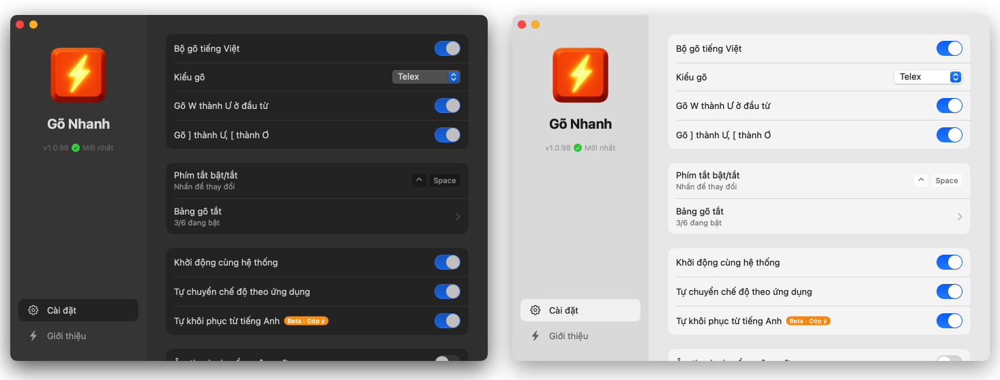

<h1 align="center">
  <br>
  Gõ Nhanh
</h1>

<p align="center">
  
  
  
</p>
<p align="center">
  
  
  
</p>

<p align="center">
  <strong>Bộ gõ tiếng Việt miễn phí, nhanh, ổn định cho Windows.</strong><br>
  Cài là dùng. Không quảng cáo. Không thu thập dữ liệu.
</p>

<p align="center">
  
</p>

---

## 📥 Tải về & Cài đặt

### 📦 Tải thủ công

| Nền tảng | Trạng thái | Tải xuống | Hướng dẫn |
|:--------:|:----------:|:---------:|:----------|
| **Windows** | ✅ Sẵn sàng | [📥 Tải GoNhanh.zip](https://github.com/khaphanspace/gonhanh.org/releases/latest) | [Xem hướng dẫn](docs/install-windows.md) |

> **Lưu ý:** File GoNhanh.zip ~70MB (self-contained, không cần cài .NET Runtime)

### Cài đặt nhanh

1. Tải và giải nén `GoNhanh.zip`
2. Chạy `GoNhanh.exe`
3. App sẽ chạy trong system tray (khay hệ thống)

## ✨ Tính năng

### 🔥 Highlight

- 🔍 **Hỗ trợ mọi app** - Chrome, VS Code, Notion, Terminal, Discord, Slack...
- 🔤 **Auto-restore tiếng Anh** — Gõ `text` `expect` `user` `push` `sort` → tự khôi phục khi nhấn space
- ⎋ **Gõ ESC tự khôi phục** — Gõ `user` → `úẻ` → nhấn **ESC** → `user`
- 🔠 **Tự viết hoa đầu câu** — Gõ `ok.` Space `b` → `B` hoa
- ⚡ **Siêu nhanh** — <1ms latency · ~5MB RAM

### 📋 Đầy đủ

- ⌨️ **Telex & VNI** — Chọn kiểu gõ quen thuộc
- 🎯 **Đặt dấu chuẩn** — Tự động theo quy tắc mới: `hoà`, `khoẻ`, `thuỷ`
- ✂️ **Gõ tắt** — `vn` → `Việt Nam`, `ko` → `không`
- 🚀 **Auto-start** — Tự khởi động cùng Windows
- 🔧 **Phím tắt tùy chỉnh** — Đổi Ctrl+Space thành phím bạn muốn

### 🛡️ Cam kết "Ba Không"

- 🚫 **Không thu phí** — Miễn phí mãi mãi, không bản Pro
- 🚫 **Không quảng cáo** — Không popup, không làm phiền
- 🚫 **Không theo dõi** — Offline 100%, mã nguồn mở

---

## 🔤 Auto-restore tiếng Anh

Khi gõ tiếng Anh bằng Telex, một số chữ cái bị nhận nhầm thành modifier tiếng Việt:
- `s` → sắc, `f` → huyền, `r` → hỏi, `x` → ngã, `j` → nặng
- `w` → dấu móc (ư, ơ)

**Gõ Nhanh tự động khôi phục** khi nhấn **Space** nếu phát hiện pattern tiếng Anh.

### ✅ Các pattern được nhận diện

| Pattern | Ví dụ | Giải thích |
|:--------|:------|:-----------|
| **Modifier + phụ âm** | `text` `next` `test` `expect` | x/s theo sau bởi phụ âm |
| **W đầu + phụ âm** | `window` `water` `write` | W không phải phụ âm đầu tiếng Việt |
| **F đầu** | `file` `fix` `function` | F không tồn tại trong tiếng Việt |

---

## ❤️‍🔥 Động lực

Tôi (**Kha Phan**) bắt đầu dự án này vì các bộ gõ hiện tại thường xuyên gặp lỗi khi tôi làm việc với **Claude Code**.

Từ nhu cầu giải quyết vấn đề cá nhân, Gõ Nhanh được phát triển thành một sản phẩm hoàn thiện dành tặng cộng đồng. Đây cũng là sự tiếp nối và kế thừa từ **UniKey**, **OpenKey** và **EVKey**.

Nếu các bạn thấy phần mềm hữu ích có thể [ủng hộ tôi tại đây](https://github.com/sponsors/khaphanspace).

---

## 🔧 Dành cho Developer

### Tech Stack

| Layer | Công nghệ |
|-------|-----------|
| **Core Engine** | Rust 2021 (pure `std`, zero runtime deps) |
| **Windows** | WPF/.NET 8 + SetWindowsHookEx + P/Invoke |
| **Testing** | rstest + serial_test (700+ tests) |
| **CI/CD** | GitHub Actions + auto-versioning |
| **Dev Tools** | [Claude Code](https://claude.ai/code) |

### Cách hoạt động

Engine dựa trên **ngữ âm học tiếng Việt** thay vì bảng tra cứu:

```
Âm tiết = [Phụ âm đầu] + [Âm đệm] + Nguyên âm chính + [Âm cuối] + Thanh điệu
          (b,c,d,g...)   (o,u)      (a,ă,â,e,ê...)    (c,m,n,p,t)  (sắc,huyền...)
```

Chi tiết: [docs/core-engine-algorithm.md](docs/core-engine-algorithm.md) | [docs/vietnamese-language-system.md](docs/vietnamese-language-system.md)

### Build & Test

```bash
# Build Rust core
cd core
cargo build --release
cargo test

# Build Windows app
cd platforms/windows/GoNhanh
dotnet build -c Release
```

### Nguyên tắc thiết kế

| Nguyên tắc | Chi tiết |
|------------|----------|
| **Anti-over-engineering** | Không abstraction layer thừa |
| **Performance-first** | Target: <1ms latency, <10MB RAM |
| **Zero dependency** | Rust core chỉ dùng `std` |
| **Test-driven** | 700+ tests với coverage cao |

### Tài liệu kỹ thuật

| Tài liệu | Mô tả |
|----------|-------|
| [Kiến trúc hệ thống](docs/system-architecture.md) | FFI, luồng dữ liệu, app compatibility |
| [Validation Algorithm](docs/validation-algorithm.md) | 5 quy tắc kiểm tra âm tiết |
| [Hệ thống chữ viết tiếng Việt](docs/vietnamese-language-system.md) | Cơ sở lý thuyết |

---

## ⭐ Star History

[](https://www.star-history.com/#khaphanspace/gonhanh.org&type=Timeline&legend=bottom-right)

---

## 📄 License

Copyright © 2025 Gõ Nhanh Contributors. [BSD-3-Clause](LICENSE).
