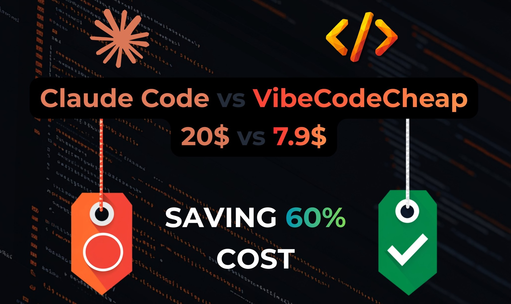

<h1 align="center">
  <br>
  FKey - Bộ gõ Tiếng Việt
</h1>

<p align="center">
  
  
  
  
</p>

<p align="center">
  <strong>Bộ gõ tiếng Việt miễn phí, nhanh, nhẹ cho Windows</strong><br>
  ~5MB · Không cần cài đặt · Không quảng cáo · Không thu thập dữ liệu
</p>

<p align="center">
  <a href="https://github.com/miken90/fkey/releases/latest">
    
  </a>
</p>

---

## 💎 Sponsor

<table>
  <tr>
    <td>
      <a href="https://vibecodecheap.com/?ref=fkey">
        
      </a>
    </td>
    <td>
      <strong><a href="https://vibecodecheap.com/?ref=SAUDF092">VibeCodeCheap</a> - AI Coding Subscriptions up to 80% OFF</strong><br/><br/>
      🎯 <strong>Full support for Amp Code & Claude Code</strong><br/>
      💰 <strong>$7.99/mo</strong> (vs $20 Claude Pro) | <strong>$29.99/mo</strong> (vs $100 Max 5x)<br/>
      ✅ Claude Opus 4.5, Sonnet 4.5, Gemini 3 Pro | 99.9% Uptime<br/><br/>
      <a href="https://vibecodecheap.com/?ref=SAUDF092"><strong>👉 Subscribe Now</strong></a>
    </td>
  </tr>
</table>

---

## ✨ Tính năng nổi bật

| Tính năng | Mô tả |
|-----------|-------|
| ⚡ **Siêu nhẹ** | ~5MB portable, ~10MB RAM |
| 🔍 **Mọi ứng dụng** | Chrome, VS Code, Terminal, Discord, Slack... |
| 🔤 **Auto-restore tiếng Anh** | `text` `expect` `user` → tự khôi phục khi nhấn Space |
| ⎋ **ESC khôi phục** | Gõ sai → nhấn ESC → về lại chữ gốc |
| 🔠 **Tự viết hoa** | Đầu câu tự động viết hoa |
| ⌨️ **Telex & VNI** | Chọn kiểu gõ quen thuộc |
| 🎯 **Đặt dấu chuẩn** | `hoà`, `khoẻ`, `thuỷ` |
| 🔧 **Phím tắt tùy chỉnh** | Ctrl+Space hoặc tuỳ ý |
| 🚀 **Auto-start** | Khởi động cùng Windows |
| 🔄 **Tự động cập nhật** | Thông báo khi có phiên bản mới |

---

## 📥 Tải về & Cài đặt

### Yêu cầu hệ thống
- Windows 10/11 (64-bit)
- WebView2 Runtime (thường có sẵn trên Windows 10/11)

### Cài đặt
1. Tải [`FKey-vX.X.X-portable.zip`](https://github.com/miken90/fkey/releases/latest) từ GitHub Releases
2. Giải nén vào thư mục bất kỳ
3. Chạy `FKey.exe`
4. App chạy trong system tray (khay hệ thống)

---

## 🛡️ Cam kết

- 🚫 **Không thu phí** — Miễn phí mãi mãi
- 🚫 **Không quảng cáo** — Không popup
- 🚫 **Không theo dõi** — Offline 100%, mã nguồn mở

---

## 🔧 Dành cho Developer

### Tech Stack

| Layer | Công nghệ |
|-------|-----------|
| **Core Engine** | Rust (zero dependencies) |
| **Windows App** | Go + Wails v3 + WebView2 |
| **Testing** | 700+ tests |

### Build từ source

```powershell
# Build Rust core
cd core
cargo build --release

# Build Windows app
cd platforms/windows-wails
.\build.ps1 -Release -Version "2.0.7"
```

### Chạy tests

```powershell
# Rust tests
cd core
cargo test

# Go tests
cd platforms/windows-wails
go test ./...
```

---

## ☕ Ủng hộ dự án

Nếu FKey hữu ích với bạn, hãy cân nhắc ủng hộ để duy trì và phát triển dự án:

<p align="center">
  <a href="https://me.momo.vn/2pIounFNtQTBIau6IlfR" target="_blank">
    
  </a>
</p>

Cảm ơn bạn đã ủng hộ! 💖

---

## 🙏 Lời cảm ơn

FKey được phát triển dựa trên nền tảng của dự án **[Gõ Nhanh](https://github.com/khaphanspace/gonhanh.org)** bởi **Kha Phan**.

Cảm ơn Kha Phan và cộng đồng Gõ Nhanh đã tạo ra engine xử lý tiếng Việt tuyệt vời. FKey tiếp nối sứ mệnh mang đến bộ gõ chất lượng cao, miễn phí cho người Việt.

---

## 📄 License

[BSD-3-Clause](LICENSE) © 2024-2026 FKey Contributors
